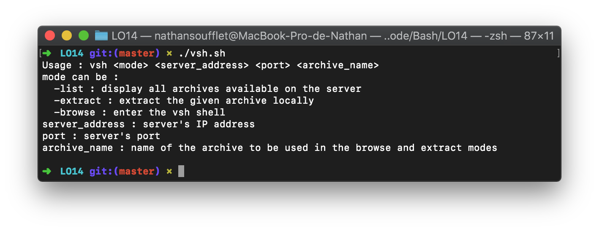

# LO14 Project

Text archive server and client in bash for the LO14 (System administration) module at the UTT.

## What it does

This project stores a list of text files along with their content in a single archive file,
such files are stored on a dedicated server which clients can connect to in order to extract an archive
locally or simply to browse the archives and manage them remotely.

## How to use

On the server, run
```bash
    ./server.sh <port>
```

Then, on the client side, use the vsh.sh script,
you can try it locally by using "localhost" as the server_address parameter

